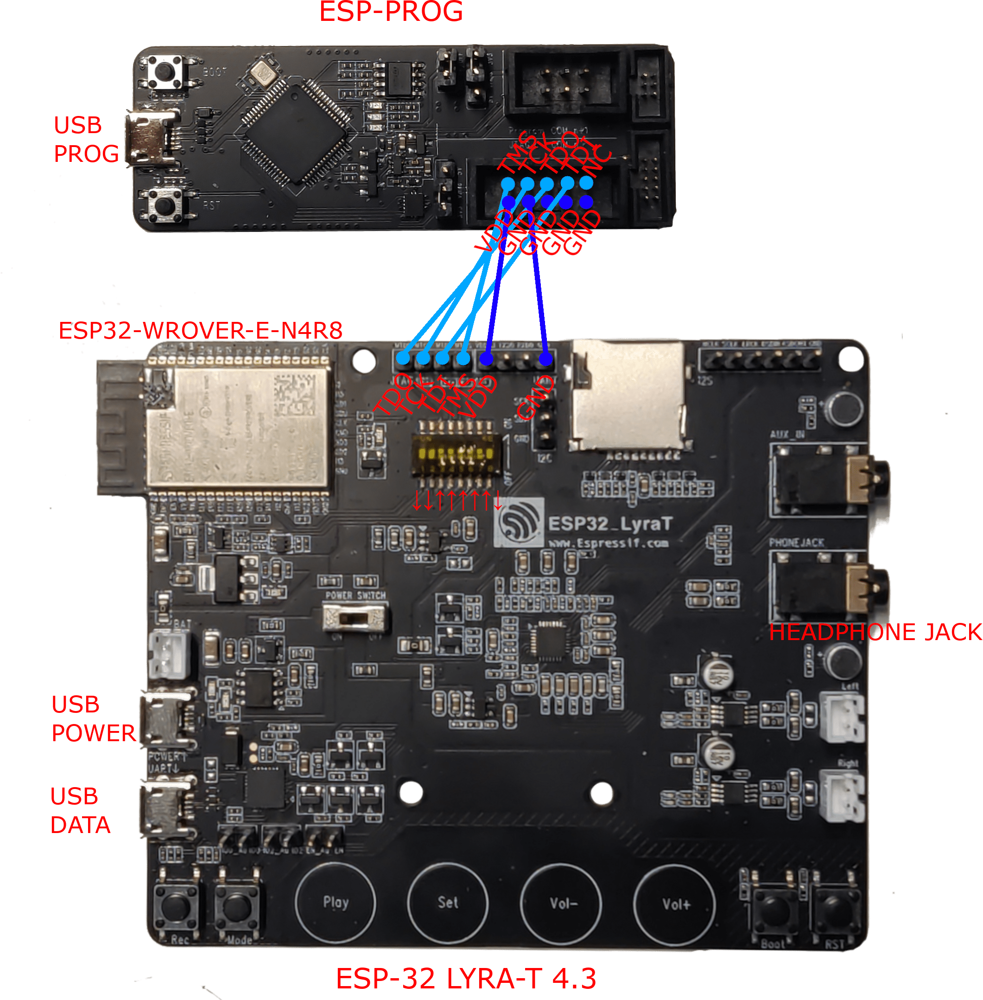

# ESP FIR Filter

For a better visualisation of this file open it with a markdown viewer. In VS Code you can press <kbd>CTRL</kbd>+<kbd>SHIFT</kbd>+<kbd>V</kbd> to open the preview.

## Project description

This project receives audio from the bluetooth, applies a FIR filter and outputs the audio to the earphone or speaker ports. The passthrough pipeline of this example is as follows:

```
[bluetooth] --> bt_stream_reader --> filter_el --> i2s_stream_writer --> [codec_chip]
```

## Hardware description

The board that we use is the [ESP32-LyraT V4.3](https://docs.espressif.com/projects/esp-adf/en/latest/design-guide/dev-boards/get-started-esp32-lyrat.html). The board uses a ESP32-WROVER-E-N4R8 module with 4MB of external flash and 8MB of PSRAM. 


## Install dependencies

You can find the full guide in the [ESP-IDF Programming Guide](https://docs.espressif.com/projects/esp-idf/en/v4.4.4/esp32/get-started/index.html#installation-step-by-step).

### Using VS Code (recommended)
You will need the [Espressif IDF](https://marketplace.visualstudio.com/items?itemName=espressif.esp-idf-extension) extension for VS Code. Afterwards open the folder in VS Code, press <kbd>CTRL</kbd>+<kbd>SHIFT</kbd>+<kbd>P</kbd> to run a command and select `ESP-IDF: Configure ESP-IDF extension` and install **version 4.4.4** of the ESP-IDF. Then press <kbd>CTRL</kbd>+<kbd>SHIFT</kbd>+<kbd>P</kbd> and select `ESP-IDF: Install ESP-ADF`. You need to install **version 2.5 or master** of the ESP-ADF.

After installing you need to set the `IDF_PATH` and `ADF_PATH` environment variables pointing to the location of the [ESP-IDF](https://github.com/espressif/esp-idf) version 4.4.4 and [ESP-ADF](https://github.com/espressif/esp-adf) version 2.5 or master.

### From the command line

Download the [ESP-IDF](https://github.com/espressif/esp-idf) **version 4.4.4** and [ESP-ADF](https://github.com/espressif/esp-adf) **version 2.5 or master**. Set the `IDF_PATH` and `ADF_PATH` environment variables pointing to the location of the repositories.

To install the tools on Windows Powershell run:

```powershell
cd $env:ESP_IDF
./install.ps1 esp32
```

To install the tools on Linux run:
    
```bash
cd $IDF_PATH
./install.sh esp32
```

## Running the project

### Hardware configuration

Make sure that the connection between the ESP-PROG and the ESP32-LyraT is as shown in the image. The position of the jumpers must be: ↓↓↑↑↑↑↑↓


### Configuration

Connect a speaker or earphone to the `HEADPHONE JACK` port of the development board. Connect a USB-A cable to your laptop and the micro USB-B port to the `USB DATA` port of the board. Connect another USB-A cable to your laptop and the micro USB-B side to the `USB PROG` of the `ESP-PROG` board.

### Build and Flash

1. Make sure to select the COM port of the `ESP32-LyraT` board in the bottom left side of the VS Code extension. 
2. Press the `BOOT` and `RST` buttons on the `ESP32-LyraT` board.
3. Run the `ESP-IDF: Build, Flash and start a monitor on your device` command to build and flash the project (you can also press <kbd>CTRL</kbd>+<kbd>E</kbd> and then <kbd>D</kbd> or press the flame 🔥 button). The code will be compiled and flashed to the board. The serial monitor will open automatically.
4. You can connect to the board through bluetooth. The board is named `ESP-FILTER`. You can play music on your smartphone and listen to it through the headphone jack of the board.

To exit the serial monitor, type ``Ctrl-]``.

See [ESP-IDF Programming Guide](https://docs.espressif.com/projects/esp-idf/en/v4.4.4/esp32/index.html) for full steps to configure and build an ESP-IDF project.


## Debugger

We use the [ESP-PROG](https://docs.espressif.com/projects/espressif-esp-iot-solution/en/latest/hw-reference/ESP-Prog_guide.html) JTAG board for debugging. To install the drivers for the ESP-PROG follow [this guide](https://docs.espressif.com/projects/esp-idf/en/v4.4.4/esp32/api-guides/jtag-debugging/configure-ft2232h-jtag.html).


### Some useful commands

You can use the `cpu_hal_get_cycle_count()` instruction to get the cycle count (CCYCLE register) of the CPU. This can be used to measure the execution time of a function. 

```c
cpu_hal_set_cycle_count(0);
uint32_t start = cpu_hal_get_cycle_count();
// Do something
uint32_t end = cpu_hal_get_cycle_count();
printf("Execution cycles: %d\n", end - start);
```

This has the downside that it is limited to the amount of instructions that you can count with 32 bits (4.3 billion) which at the default frequency of 160MHz is about 26 seconds. To get around this you can use the `esp_timer_get_time()` instruction to get the time in microseconds (64bits) since startup. This has a limit of 584 years. 

```c
uint64_t start = esp_timer_get_time();
// Do something
uint64_t end = esp_timer_get_time();
printf("Execution time: %d\n", end - start);
```

### GDB tips and tricks

If you are using GDB from VS Code you can run custom commands from the Debug console and prefixing them with `-exec`. For example:

- To print the value of the HAL cycle count: `-exec print $ccycle`
- To print all registers: `-exec info registers`
- To show all threads: `-exec info threads`

## Configuring the project

The project is configured through the `sdkconfig` files. When no `sdkconfig` file exists, the default values of the `sdkconfig.defaults.*` will be used. You can edit these values on the GUI configuration tool by running the `ESP-IDF: Open Project Configuration Menu` command.

Some useful parameters to change are:
- Optimization level. Set one of the following variables to `y`:
    - `CONFIG_COMPILER_OPTIMIZATION_DEFAULT`: Default optimization level
    - `CONFIG_COMPILER_OPTIMIZATION_SIZE`: Optimize for size
    - `CONFIG_COMPILER_OPTIMIZATION_PERF`: Optimize for performance
    - `CONFIG_COMPILER_OPTIMIZATION_NONE`: Disable optimization
- Frequency of the board:
    - `CONFIG_ESP32_DEFAULT_CPU_FREQ_40`: 40MHz
    - `CONFIG_ESP32_DEFAULT_CPU_FREQ_80`: 80MHz
    - `CONFIG_ESP32_DEFAULT_CPU_FREQ_160`: 160MHz
    - `CONFIG_ESP32_DEFAULT_CPU_FREQ_240`: 240MHz

You can read the full set of configuration options in the [ESP-IDF Kconfig documentation](https://docs.espressif.com/projects/esp-idf/en/v4.4.4/esp32/api-reference/kconfig.html#configuration-options-reference).


## Optimization techniques

You can check the full performance optimization guide [here](https://docs.espressif.com/projects/esp-idf/en/v4.4.4/esp32/api-guides/performance/index.html). Some common tricks are:
- Make sure that you are building the project with optimization enabled.
- Avoid using floating point arithmetic (`float` or `double`).
- Move frequently used code to IRAM. By default all code is executed from flash cache. So, instructions need to be fetch from flash memory which is slow. If you move the code to IRAM, the instructions will be fetched from the faster RAM memory. To move a function to IRAM see [IRAM](https://docs.espressif.com/projects/esp-idf/en/v4.4.4/esp32/api-guides/memory-types.html#iram). **Be careful, IRAM size is limited**.
- Check core assignment of the tasks
- Check the priority of the tasks
